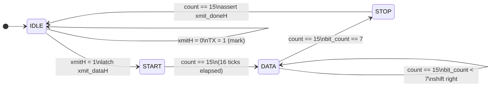
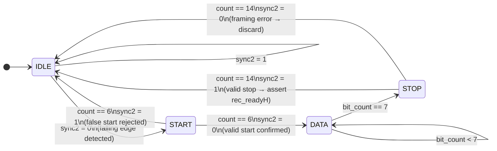

# MICRO_UART_PROJECT

# UART — RTL Design & Functional Verification

> **Universal Asynchronous Receiver / Transmitter**  
> Fully parameterized, synthesizable Verilog HDL implementation with a self-checking testbench and 97.20% functional coverage.


---

## Table of Contents

1. [Project Overview](#1-project-overview)
2. [Design Architecture](#2-design-architecture)
3. [Module Descriptions](#3-module-descriptions)
4. [Signal Reference](#4-signal-reference)
5. [Parameters & Configuration](#5-parameters--configuration)
6. [FSM State Diagrams](#6-fsm-state-diagrams)
7. [Timing Behaviour](#7-timing-behaviour)
8. [Testbench Architecture](#8-testbench-architecture)
9. [Simulation Results](#9-simulation-results)
10. [Coverage Report](#10-coverage-report)
11. [RTL Quality Checks](#11-rtl-quality-checks)
12. [Repository Structure](#12-repository-structure)
13. [How to Simulate](#13-how-to-simulate)
14. [Future Work](#14-future-work)

---

## 1. Project Overview

This project implements a complete **8N1 UART** (8 data bits, No parity, 1 stop bit) in synthesizable Verilog HDL. The design uses **16× oversampling** for robust mid-bit sampling, making it immune to moderate clock frequency mismatches between transmitter and receiver.

The design is fully parameterized — the system clock frequency and baud rate can be changed at elaboration time via `inc.h` macros, requiring no RTL modifications.

**Key Highlights:**
- 16× oversampled baud rate generator for noise-immune reception
- 4-state FSMs for both transmitter and receiver
- 2-FF metastability synchronizer on the RX data line
- False start bit rejection (sub-half-bit noise immunity)
- Active-low synchronous reset with zero warm-up latency
- Self-checking testbench with directed + random stimulus
- **97.20% functional coverage** (>95% target), 100% toggle and FSM state coverage

---

## 2. Design Architecture

The design is organized as a 4-module hierarchy under the top-level wrapper `uart.v`.

```
                         ┌──────────────────────────────────────────────┐
                         │              uart.v  (Top-Level Wrapper)       │
                         │                                                │
  sys_clk ──────────────►│  ┌──────────┐    uart_clk (16x oversample)    │
  sys_rst_l ────────────►│  │  baud.v  ├──────────────────────┐          │
                         │  └──────────┘                       │          │
  xmitH ───────────────► │                             ┌───────┴───────┐  │──► uart_xmit_dataH
  xmit_dataH[7:0] ──────►│                             │   u_xmit.v    │  │──► xmit_active
                         │                             │  (Transmitter) │  │──► xmit_doneH
                         │                             └───────┬───────┘  │
                         │                                     │          │
  uart_REC_dataH ───────►│                             ┌───────┴───────┐  │──► rec_dataH[7:0]
                         │                             │   u_rec.v     │  │──► rec_readyH
                         │                             │  (Receiver)   │  │──► rec_busy
                         │                             └───────────────┘  │
                         └──────────────────────────────────────────────┘
```

**Data Flow:**
1. `baud.v` divides `sys_clk` to produce a `uart_clk` toggle at 16× the baud rate
2. `u_xmit.v` serializes an 8-bit parallel word into a start–data–stop serial frame
3. `u_rec.v` deserializes the incoming serial stream, sampling at bit centers (tick 7/15)

---

## 3. Module Descriptions

### `baud.v` — Baud Rate Generator
Divides the system clock down to a 16× oversampled baud clock. The divider count is calculated at elaboration time using the `$clog2` and macro arithmetic in `inc.h`, ensuring the correct counter width and toggle period for any FPGA clock frequency.

```
CLK_DIV = XTAL_CLK / (BAUD × 16 × 2)
```

The `uart_clk` output toggles every `CLK_DIV` system clock cycles, producing 16 enable pulses per UART bit period.

---

### `u_xmit.v` — Transmitter
A 4-state Mealy/Moore FSM that performs parallel-to-serial conversion. When `xmitH` is asserted, it latches the 8-bit `xmit_dataH` bus into an internal shift register and serializes it LSB-first, framed by a start bit (logic 0) and a stop bit (logic 1).

**Internal resources:**
- `data[7:0]` — shift register (right-shift to extract LSB each tick)
- `count[3:0]` — 4-bit oversampling counter (0–15 per bit cell)
- `bit_count[2:0]` — tracks which of the 8 data bits is currently being sent

---

### `u_rec.v` — Receiver
A 4-state FSM with a **2-FF metastability synchronizer** on the incoming `uart_REC_dataH` line. The receiver samples the synchronized RX line at tick 7 for start-bit verification and tick 15 for each data/stop bit, implementing classic 16× oversampled mid-bit sampling.

**Internal resources:**
- `sync1`, `sync2` — 2-FF synchronizer chain
- `temp_data[7:0]` — right-shift deserialization register (MSB←sync2)
- `count[3:0]` — oversampling counter
- `bit_count[2:0]` — tracks received bit index

---

### `uart.v` — Top-Level Wrapper
Instantiates `baud`, `u_xmit`, and `u_rec`, wires the shared `uart_clk`, and exposes a clean external port interface. No logic resides at this level.

---

## 4. Signal Reference

### Inputs

| Signal | Width | Description |
|---|---|---|
| `sys_clk` | 1-bit | System clock (frequency set via `inc.h`) |
| `sys_rst_l` | 1-bit | Active-low synchronous reset |
| `xmitH` | 1-bit | Transmit enable — assert for ≥1 clock, release after `xmit_active` |
| `xmit_dataH` | 8-bit | Parallel data byte to serialize and transmit |
| `uart_REC_dataH` | 1-bit | Serial RX input (loopback or external) |

### Outputs

| Signal | Width | Description |
|---|---|---|
| `uart_xmit_dataH` | 1-bit | Serial TX line — idles high (mark state) |
| `xmit_doneH` | 1-bit | Pulses high when transmitter returns to IDLE |
| `xmit_active` | 1-bit | High while a transmission is in progress |
| `rec_dataH` | 8-bit | Received parallel byte — valid when `rec_readyH` is high |
| `rec_readyH` | 1-bit | Pulses high for exactly one clock on valid byte reception |
| `rec_busy` | 1-bit | High while receiver is processing an incoming frame |

---

## 5. Parameters & Configuration

All timing parameters are centralized in `inc.h`:

```verilog
`define WORD_LEN   8                            // Data bits per frame
`define XTAL_CLK   100_000_000                  // System clock (Hz)
`define BAUD       2400                         // Target baud rate (bps)
`define CW         $clog2(`XTAL_CLK/(`BAUD*16*2))  // Counter width (bits)
`define CLK_DIV    (`XTAL_CLK / (`BAUD*16*2))  // Divider count
```

To retarget the design, only `XTAL_CLK` and `BAUD` need to be changed. All counter widths and timing derive automatically.

**Common configurations:**

| `XTAL_CLK` | `BAUD` | `CLK_DIV` | `CW` |
|---|---|---|---|
| 100 MHz | 2400 | 1302 | 11 |
| 50 MHz | 9600 | 326 | 9 |
| 100 MHz | 115200 | 27 | 5 |

---

## 6. FSM State Diagrams

### Transmitter FSM (`u_xmit.v`)



| State | TX Line | Duration | Action |
|---|---|---|---|
| `IDLE` | 1 (mark) | Until `xmitH` | Waits; asserts `xmit_doneH` |
| `START` | 0 (space) | 16 ticks | Start bit; asserts `xmit_active` |
| `DATA` | `data[0]` | 16 ticks × 8 | Serializes LSB-first; right-shifts |
| `STOP` | 1 (mark) | 16 ticks | Stop bit; pulses `xmit_doneH` |

---

### Receiver FSM (`u_rec.v`)



| State | Condition | Next State | Notes |
|---|---|---|---|
| `IDLE` | RX falls low | `START` | Falling edge detection |
| `START` | Tick 6, RX still low | `DATA` | Valid start confirmed at mid-point |
| `START` | Tick 6, RX high | `IDLE` | False start (noise) rejected |
| `DATA` | 16 ticks × 8 bits | `STOP` | Sample at tick 15 of each bit cell |
| `STOP` | Tick 14, RX high | `IDLE` | Valid frame; `rec_readyH` pulsed |
| `STOP` | Tick 14, RX low | `IDLE` | Framing error; data discarded |

---

## 7. Timing Behaviour

### Baud Rate & Oversampling

The baud generator produces 16 `uart_clk` ticks per UART bit period. This allows the receiver to verify the start bit at **tick 7** (mid-point of the start cell) and sample each subsequent bit at **tick 15** (center of each bit cell), maximizing setup/hold margins.

```
  One UART bit period = 16 uart_clk ticks
  
  ┌──────────────────────────────────────────────────────────┐
  │  Tick:  0   1   2   3   4   5   6   7   8   9  ...  15  │
  │                                   ▲                  ▲   │
  │                              Mid-start           Mid-bit │
  │                              verify             sample   │
  └──────────────────────────────────────────────────────────┘
```

### Full Frame Timing

```
  uart_xmit_dataH:
  ‾‾‾‾┐           ┌──── D0 ────┬──── D1 ────┬─ ... ─┬──── D7 ────┐           ┌‾‾‾‾
      │  START BIT │            │            │       │            │  STOP BIT  │
      └────────────┘            └────────────┘       └────────────┘            └────

  Total frame = 10 bit-periods = 160 uart_clk ticks
```

### Reset Latency

After `sys_rst_l` is de-asserted, the transmitter immediately signals `xmit_doneH = 1` (IDLE state) on the next clock. No warm-up or initialization delay is required.

---

## 8. Testbench Architecture

The testbench (`uart_tb.v`) instantiates the DUT three times in a loopback configuration to exercise multi-receiver fan-out:

```
                   ┌──────────────────────────────────────────────┐
                   │                uart_tb.v                       │
                   │                                                │
                   │  ┌─────────────────────────────────────────┐  │
                   │  │  utx  (Transmitter + Loopback Receiver)  │  │
                   │  │  sys_clk = 100 MHz (10 ns period)       │  │
                   │  └──────────────┬──────────────────────────┘  │
                   │  uart_xmit_dataH│                              │
                   │         ┌───────┴─────────────┐               │
                   │         │                     │               │
                   │  ┌──────▼──────┐    ┌─────────▼──────┐        │
                   │  │    urx      │    │   urx_slow      │        │
                   │  │ Independent │    │  Independent    │        │
                   │  │   clock     │    │    clock        │        │
                   │  └─────────────┘    └────────────────┘        │
                   └──────────────────────────────────────────────┘
```

All three instances share the **same baud rate** and are driven from the same TX serial output, verifying correct multi-receiver fan-out reception.

### Testbench Tasks

| Task | Purpose |
|---|---|
| `sys_reset` | Applies 100 ns active-low reset; initializes all FSMs and counters |
| `send_byte` | Sends a single byte using `xmitH` handshake; waits for `xmit_doneH` |
| `send_byte_later_reset` | Sends a byte then injects a mid-transmission reset to test recovery |
| `send_continuous_bytes` | Streams 10 `$urandom` bytes back-to-back for pipeline stress testing |
| `pseudo_start_bit` | `force`s a sub-half-bit glitch on TX to validate false start rejection |
| `invalid_states` | Forces all 6 FSM instances to illegal state `3'b111`; verifies default→IDLE recovery |
| `negative_test` | Sends `0xFF`, checks against `0x00`; confirms scoreboard error detection |
| `check_received_byte` | `fork…join` scoreboard comparing all 3 receiver outputs against expected value |
| `drivmonscore` | Master orchestration task — runs the complete test plan in sequence |

### Test Plan (via `drivmonscore`)

1. 5 random bytes — baseline normal operation
2. Mid-transmission reset during DATA phase (5 bit-periods in)
3. Mid-transmission reset during START phase (1/3 bit-period in)
4. Post-reset state check
5. 10 continuous random bytes — pipeline streaming
6. False start bit injection
7. Invalid FSM state forcing (all 6 FSM instances)
8. Intentional mismatch — scoreboard negative test

---

## 9. Simulation Results

### Transmitter Waveform

After reset, `xmit_doneH` immediately asserts (IDLE). On `xmitH`, the transmitter latches `xmit_dataH`, drives the TX line low (start bit), increments `bit_count[2:0]` through 0→7 during DATA, and the `ps[2:0]` state register cycles:

```
  State:  IDLE(0) → START(1) → DATA(2) → STOP(3) → IDLE(0)
  TX:     ‾‾‾‾‾‾‾    ______     D0..D7     ‾‾‾‾‾‾    ‾‾‾‾‾‾
```

Sample result from waveform: transmitted byte `0x45` was correctly recovered by the loopback receiver as `rec_dataH = 0x45`.

### Receiver Waveform

- `rec_busy` asserts on start-bit detection and holds through START + 8 DATA + STOP bits
- `rec_readyH` pulses for exactly **one clock cycle** after stop-bit validation
- `temp_data` (internal shift register) accumulates partial values LSB-first during DATA phase
- Multiple back-to-back frames are cleanly separated with no data corruption

---

## 10. Coverage Report

Functional coverage was measured using **Questa SIM**. The overall project target was ≥95%; the achieved result was **97.20%**.

### Overall Summary (All Scopes)

| Scope | Total | Statement | Branch | Toggle | FSM State | FSM Trans |
|---|---|---|---|---|---|---|
| **TOTAL** | **97.20** | 98.17 | 94.82 | 100.00 | 100.00 | 91.66 |
| `utx` (U_TOP) | 96.98 | 97.46 | 94.64 | 100.00 | 100.00 | 91.66 |
| `urx` (U_TOP) | 96.98 | 97.46 | 94.64 | 100.00 | 100.00 | 91.66 |
| `urx_slow` (U_TOP) | 96.98 | 97.46 | 94.64 | 100.00 | 100.00 | 91.66 |
| Testbench tasks | 100.00 | 100.00 | 100.00 | 100.00 | — | — |

### Transmitter Coverage (`u_xmit`)

| Type | Bins | Hits | Misses | Coverage |
|---|---|---|---|---|
| Statements | 35 | 34 | 1 | 97.14% |
| Branches | 23 | 22 | 1 | 95.65% |
| Toggles | 64 | 64 | 0 | **100.00%** |
| FSM States | 4 | 4 | 0 | **100.00%** |
| FSM Transitions | 6 | 5 | 1 | 83.33% |
| **Total** | | | | **96.11%** |

> The 1 uncovered FSM transition corresponds to a degenerate IDLE→STOP path that is unreachable under valid 8N1 operation. The 1 uncovered branch is the framing-error discard path (deliberate low stop bit), not exercised in this testbench.

### Receiver Coverage (`u_rec`)

| Type | Bins | Hits | Misses | Coverage |
|---|---|---|---|---|
| Statements | 37 | 36 | 1 | 97.29% |
| Branches | 29 | 27 | 2 | 93.10% |
| Toggles | 68 | 68 | 0 | **100.00%** |
| FSM States | 4 | 4 | 0 | **100.00%** |
| FSM Transitions | 6 | 6 | 0 | **100.00%** |
| **Total** | | | | **97.60%** |

> The receiver achieves **100% FSM transition coverage** — including the START→IDLE false start rejection arc — thanks to the `pseudo_start_bit` test. The 2 uncovered branches correspond to the framing error path and a data-dependent condition.

---

## 11. RTL Quality Checks

| Check | Observation | Status |
|---|---|---|
| `` `default_nettype none `` | Declared in all RTL files | ✅ PASS |
| Reset completeness | All registers assigned in reset branch of every `always` block | ✅ PASS |
| FSM default case | `default: ns = S_IDLE` present in TX and RX FSMs | ✅ PASS |
| Metastability synchronizer | 2-FF chain on `uart_REC_dataH` inside `u_rec` | ✅ PASS |
| Parameterization | Clock and baud rate fully parameterized via `inc.h` macros | ✅ PASS |
| Counter width | `$clog2(CLK_DIV)` used for minimal register sizing | ✅ PASS |
| Combinational loops | No combinational feedback detected | ✅ PASS |
| Latch inference | No latches — all outputs registered | ✅ PASS |

---

## 12. Repository Structure

```
uart-rtl/
├── inc.h               # Central parameter/macro header
├── uart.v              # Top-level wrapper (U_TOP)
├── baud.v              # Baud rate generator (U_BAUD)
├── u_xmit.v            # Transmitter FSM (U_TRANS)
├── u_rec.v             # Receiver FSM (U_REC)
└── README.md
```

---

## 13. How to Simulate

### Prerequisites
- **Questa SIM** (Mentor/Siemens) — any version supporting Verilog-2001
- A `uart_tb.v` testbench file instantiating the DUT three times (utx, urx, urx_slow) with loopback connections

### Steps

```bash
# 1. Compile all design and testbench files
vlog inc.h baud.v u_xmit.v u_rec.v uart.v uart_tb.v

# 2. Launch simulation (replace 'work' with your library name if different)
vsim -coverage work.uart_tb

# 3. (Optional) Add signals to wave window and run
add wave -recursive *
run -all

# 4. Generate coverage report
coverage report -html -output coverage_report/
```

> **Tip:** The testbench uses `wait()` constructs instead of fixed delays, so it is robust to changes in `XTAL_CLK` and `BAUD` in `inc.h` without testbench modifications.

---

## 14. Future Work

| Enhancement | Description |
|---|---|
| **Parity Support** | Add configurable even/odd/none parity by inserting a `PARITY` state between `DATA` and `STOP` |
| **Hardware Flow Control** | RTS/CTS handshaking signals to prevent buffer overrun at high throughput |
| **FIFO Integration** | TX and RX FIFOs to decouple CPU interface latency from serial baud timing |
| **UVM Migration** | Port the task-based testbench to a UVM environment with sequence library and functional coverage model |
| **Framing Error Injection** | Dedicate a test sequence for deliberate low stop-bit injection to close the 2 missing receiver branches |
| **Baud Auto-Detection** | Measure start-bit pulse width to self-configure the baud divider without software intervention |
| **FPGA Prototype** | Validate on Artix-7 or Zynq with a physical USB-UART bridge |

---

## Author

**Vedant Vasant Kunjar** — Roll No. 6948  
Tools: Vivado (Xilinx/AMD) · Questa SIM (Mentor/Siemens)  
Language: Verilog HDL

---

*For academic and engineering reference use only.*
